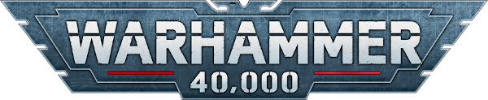

# Cartas de Referencia Táctica de Warhammer 40k

<div align="center">




**Referencia rápida, citada y offline-first para Warhammer 40,000**

[Inicio Rápido](#inicio-rápido) • [Modos](#modos) • [Navegación](#navegación) • [Datos y fuentes](#datos-y-fuentes)

</div>

---

## Acerca de

Esta aplicación web vanilla ayuda a resolver dudas de mesa con el menor número
posible de toques. Su interfaz está organizada alrededor de las cinco fases
oficiales que usa este proyecto:

1. **Mando**
2. **Movimiento**
3. **Disparo**
4. **Carga**
5. **Combate**

No existe una fase independiente de Moral en esta navegación. El
acobardamiento se consulta dentro de Mando.

El contenido de reglas se carga desde JSON citado y no se duplica como HTML
estático. La aplicación no pretende validar la legalidad de una lista ni
sustituir los libros oficiales.

## Inicio Rápido

La aplicación necesita servirse por HTTP para poder cargar sus datos JSON y
registrar el service worker:

```bash
python -m http.server 8000 --directory public
```

Después abre <http://localhost:8000/index.html>.

También puedes usar cualquier servidor estático equivalente. No hay framework,
bundler ni paso de compilación.

## Modos

### Modo Mesa

Es el modo predeterminado para una partida. Prioriza las decisiones de mesa:

- cinco fases en la barra inferior fija;
- dashboard con ronda, turno, PM, PV y fase actual;
- pasos numerados de la fase;
- tablas de consulta rápida;
- chips de habilidades contextuales;
- estratagemas filtradas por fase y momento;
- búsqueda literal del contenido citado.

No renderiza `flavor`, ejemplos ni nodos marcados como
`no_confirmado`.

### Modo Estudio

Se activa desde la cabecera y queda persistido en el navegador. Añade el
índice completo de reglas, glosario, ejemplos, flavor y bloques visuales para
contenido que las fuentes suministradas no confirman de forma independiente.

## Navegación

La ruta principal está diseñada para resolver una consulta en dos toques:

1. toca la fase en la barra inferior;
2. toca el paso, tabla, chip o estratagema relevante.

La barra fija contiene Mando, Movimiento, Disparo, Carga y Combate, además de
accesos a búsqueda y roster. Las rutas son hash-based y se pueden compartir o
abrir directamente, por ejemplo:

```text
#/dashboard
#/fase/disparo
#/estratagemas/movimiento
#/regla/24.11
#/buscar
```

Los números `1`–`5` cambian de fase cuando no se están usando modificadores de
teclado. La navegación del navegador conserva atrás/adelante.

### Sheets de detalle

Los chips y referencias usan IDs estables mediante `data-ref`. Una sheet
granular muestra:

- texto literal o contextual;
- cita y página;
- referencias relacionadas;
- enlace para leer la sección completa.

La pila admite hasta tres niveles. `‹`, Escape, un gesto descendente iniciado
en la cabecera o tocar fuera permiten volver o cerrar.

### Estado de partida

El estado persistente incluye ronda, turno, fase actual, paso activo, PM/PV,
usos de estratagemas, bajas, heridas y un historial undoable de mutaciones de
partida. La navegación de fase es estado de interfaz y no contamina el
historial de deshacer. El botón de deshacer describe la acción que revertirá,
por ejemplo el gasto y nombre de una estratagema.

## Estratagemas y búsqueda

Las estratagemas se filtran por fase, momento (`tu_turno`,
`turno_rival` o `cualquiera`), PM disponible, uso previo en la fase y
restricciones de objetivo. Las entradas inelegibles permanecen visibles,
atenuadas y explican el motivo.

La búsqueda construye un índice sin dependencias al cargar los datos. Ignora
acentos y corchetes, busca dentro del texto literal y conserva los seis
últimos términos.

## Datos y fuentes

El contenido de reglas vive en `public/data/`:

- `rules.json`: secciones y pasos numerados;
- `abilities.json`: habilidades de armas y reglas universales;
- `stratagems.json`: estratagemas básicas, fases, momentos y campos literales;
- `keywords.json`: claves contextuales;
- `tables.json`: tablas de consulta;
- `roster/`: espacio reservado para datos de roster futuros.

Cada nodo tiene un `id` estable y una `cita` con `pagina`. Cuando el material
suministrado no permite confirmar una afirmación, el nodo usa
`no_confirmado: true` y una `nota`. El validador comprueba JSON, IDs únicos,
referencias `ver_tambien` resolubles y citación.

La aplicación se construyó a partir de las fuentes oficiales españolas
suministradas para este proyecto: las reglas básicas y el documento de
actualizaciones universales. Esas fuentes cubren reglas básicas, fases,
secuencia de ataque, características, tablas, terreno, objetivos,
acobardamiento, reservas, transportes, unidades adjuntas, aeronaves,
monstruos/vehículos, habilidades, reglas universales y estratagemas incluidas
en los documentos.

Las fuentes suministradas **no cubren** de forma confirmable:

- reglas completas de construcción de listas;
- destacamentos, DP, mejoras o costes de puntos;
- validación de legalidad de un roster;
- una tabla universal completa de PV o misiones.

La aplicación no inventa esos sistemas. Patrulla continúa siendo una
superficie separada con contenido de **10.ª edición**, identificada con su
badge correspondiente; su migración queda para una fase posterior.

Para reglas completas y cualquier material no incluido aquí, consulta las
publicaciones oficiales.

## PWA y uso offline

El service worker precachea el shell, módulos, JSON de reglas, datos de
Patrulla y recursos necesarios. La aplicación intenta primero la red y usa la
cache como respaldo para mantener la consulta disponible sin conexión después
de la primera carga.

## Scripts de desarrollo

```bash
npm run validate:data  # valida JSON, IDs y referencias
npm run format         # formatea datos, UI y tooling
npm run format:check   # comprueba el formato
```

Prettier solo se usa como herramienta de desarrollo. El runtime no tiene
dependencias externas.

## Estructura del Proyecto

```text
40k-reglas-simples/
├── public/
│   ├── index.html             # shell mínimo de la aplicación 11e
│   ├── app/
│   │   ├── app.js             # arranque, eventos y estado visual
│   │   ├── data.js            # carga e índice de nodos citados
│   │   ├── router.js          # router hash
│   │   ├── state.js           # partida, persistencia y undo
│   │   ├── sheets.js          # pila de sheets y referencias
│   │   ├── search.js          # índice de búsqueda
│   │   ├── views.js            # dashboard y vistas data-driven
│   │   └── app.css             # tema oscuro y layout tabletop
│   ├── data/
│   │   ├── rules.json
│   │   ├── abilities.json
│   │   ├── stratagems.json
│   │   ├── keywords.json
│   │   ├── tables.json
│   │   └── roster/
│   ├── patrulla.html           # superficie separada 10e
│   ├── patrulla.js
│   ├── patrulla.css
│   ├── patrols.json
│   ├── sw.js                   # cache PWA
│   └── manifest.json
├── scripts/
│   └── validate-data.js        # validador sin dependencias
├── package.json
└── README.md
```

## Aviso Legal

Esta aplicación es una herramienta de referencia no oficial creada para uso
personal y propósitos educativos. No está afiliada, respaldada o patrocinada
por Games Workshop Ltd.

**Warhammer 40,000** es una marca registrada de Games Workshop Ltd. Todas las
reglas del juego, terminología y contenido son propiedad intelectual de Games
Workshop Ltd.

Esta herramienta se proporciona bajo principios de Uso Justo solo para
propósitos educativos y de referencia. Para reglas oficiales y contenido
completo del juego, consulta los libros de reglas oficiales de
**Warhammer 40,000** y las publicaciones de Games Workshop.

## Soporte y Contacto

- **GitHub Issues**: [Reportar errores o solicitar características](https://github.com/DiegoVallejoDev/40k-reglas-simples/issues)
- **Desarrollador**: [Diego Vallejo](https://github.com/diegovallejodev/)
- **Licencia**: Licencia MIT — consulta [LICENSE](LICENSE)

---

<div align="center">

**¡Por el Emperador!**

_Hecho con dedicación para la comunidad de Warhammer 40k_

</div>
